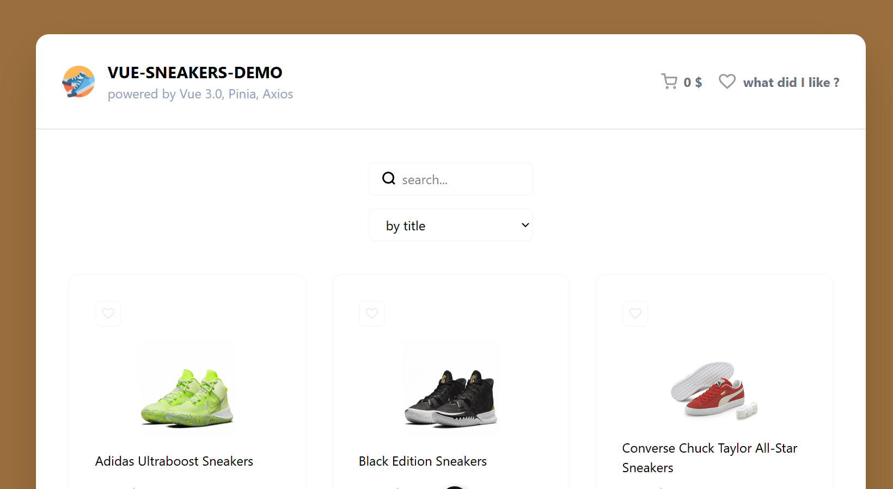
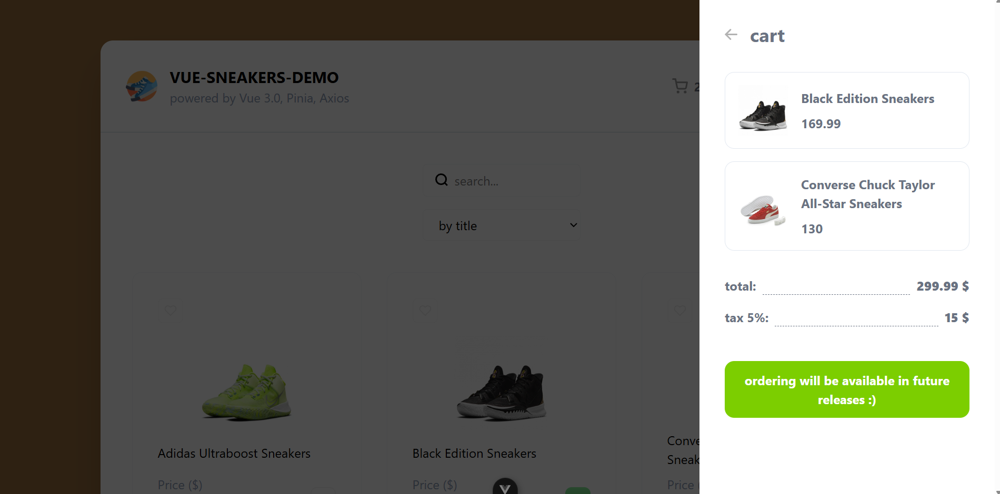

### 👟 Sneakers Shop

**Элегантный интернет-магазин кроссовок, построенный на современном стеке Vue.js.** Это pet-проект, демонстрирующий ключевые навыки фронтенд-разработки

---

## 🚀 Особенности

*   **Каталог товаров:** Сетка товаров с карточками, содержащими изображения, цены, названия и кнопки быстрого добавления в корзину.
*   **Корзина:** Отражаются товары и цена за них.
*   **Избранное:** Возможность добавлять товары в список желаний с сохранением состояния.
*   **Адаптивный дизайн:** Корректное отображение на мобильных устройствах, планшетах и десктопах.
*   **Фильтрация:** Поиск товаров по названию.
*   **Имитация бэкенда:** Работа с мок JSON-файлом

---

## 🛠 Технологический стек

*   **Фреймворк:** 
*   **Состояние:** 
*   **Маршрутизация:** 
*   **HTTP-клиент:** 
*   **Стили:** 
*   **Инструменты:** , , 

---

## 📦 Структура проекта (основное)

```
vue-sneakers-shop/
├── public/
│   └── img                       # Картинки
├── src/
|   ├── api/                      # Ручки к backend
│   ├── assets/                   # Статические ресурсы (шрифты, глобальные стили)
│   ├── components/               !Переиспользуемые Vue-компоненты
│   │   ├── Card.vue
│   │   ├── Cart.vue
│   │   ├── CardList.vue
│   ├── stores/                   !Хранилища Pinia (состояние корзины, избранного)
│   │   ├── shop.ts
│   ├── views/                    !Страницы приложения
│   │   ├── HomeView.vue          !Главная страница с каталогом
│   ├── router/                   !Конфигурация маршрутизатора
│   │   └── index.ts              !Маршруты
│   ├── App.vue                   !Корневой компонент
│   └── main.ts                   !Точка входа
├── .gitignore
├── index.html
├── package.json
├── vite.config.js                !Конфигурация Vite
└── README.md
```

---

## ⚙️ Установка и запуск

1.  **Клонируйте репозиторий:**
    ```bash
    git clone https://github.com/your-username/sneakers-shop.git
    cd sneakers-shop
    ```

2.  **Установите зависимости:**
    ```bash
    npm install
    # или
    yarn install
    # или
    bun install
    ```

3.  **Запустите сервер для разработки:**
    ```bash
    npm run dev
    # или
    yarn dev
    # или
    bun run dev
    ```
    Приложение будет доступно по адресу: [http://localhost:5173](http://localhost:5173)

---

## 📸 Скриншоты

**Главная страница с каталогом:**


**Корзина с товарами:**


---

## 📝 Планы по развитию

*   [ ] Добавить детальную страницу товара.
*   [ ] Добавить слайдеры для изображений на карточке товара.
*   [ ] Внедрить модульные тесты (Vitest) и e2e тесты (Cypress).
*   [ ] Добавить страницу оформления заказа с формой.

---

## 🤝 Вклад в проект

Это pet-проект, созданный для обучения, но если у вас есть идеи или вы нашли баг — feel free to open an issue or pull request.

1.  Сделайте fork репозитория.
2.  Создайте ветку для своей фичи (`git checkout -b feature/amazing-feature`).
3.  Закоммитьте изменения (`git commit -m 'Add some amazing feature'`).
4.  Запушьте в ветку (`git push origin feature/amazing-feature`).
5.  Откройте Pull Request.

---

## 👨‍💻 Автор

*   **Ivan Platunov** – [Ваш GitHub](https://github.com/vnn-ktt)

---

*Поставьте ⭐️ на репозиторий, если проект вам понравился!*